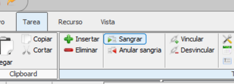
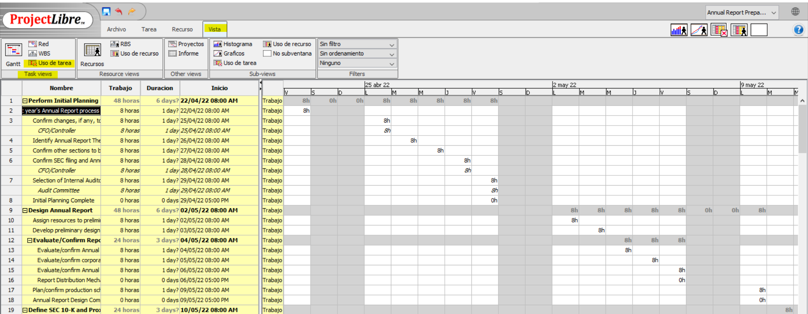
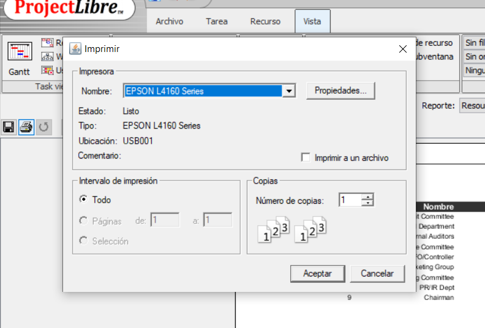

## Manual de Usuario par ProjectLibre 

**Versión:** 1.0  
**Fecha:** 2024-09-03

---

### Autores
 - Cardozo Briceño César Antonio
 - Gamarra Diéguez Esteban
 - Chávez Marín Yeyson
 - Ramírez Huamán Ricardo

### Resumen
Este manual de usuario proporciona una guía completa para el uso de ProjectLibre. Está diseñado para ayudar a los usuarios a familiarizarse con las funcionalidades básicas y avanzadas del software, asegurando una experiencia de usuario óptima. El manual cubre desde la instalación inicial hasta la resolución de problemas comunes, proporcionando instrucciones claras y concisas para cada etapa del proceso.

### Contenidos
1. [Introducción](#introducción)
2. [Instalación](#instalación)
3. [Uso Básico](#uso-básico)
4. [Funcionalidades Avanzadas](#funcionalidades-avanzadas)
5. [Glosario](#glosario)

---

**Copyright** © 2024 UPN. Todos los derechos reservados.

---

# Introducción

## ProjectLibre

Es un software de administración de proyectos que se puede ejecutar en diferentes sistemas operativos. Permite introducir y gestionar tareas, fechas límite, predecesoras y recursos, ya sean materiales, humanos o de coste. Además, ofrece la capacidad de imprimir gráficos y emitir informes, facilitando una visión clara del progreso del proyecto.

## Importancia en la Gestión de Proyectos

- Ayuda a planificar y organizar tareas, fechas y recursos de manera eficiente.
- Facilita el seguimiento del avance del proyecto, permitiendo realizar ajustes según sea necesario.
- Permite una asignación y gestión adecuada de los recursos, minimizando el riesgo de sobrecarga o escasez.
- Los informes y gráficos proporcionan una visión clara y accesible del estado del proyecto, mejorando la comunicación entre los miembros del equipo y las partes interesadas.

# Instalación

## Requisitos del Sistema

Para asegurar que ProjectLibre funcione de manera óptima en tu dispositivo, asegúrate de cumplir con los siguientes requisitos del sistema:

### Requisitos Mínimos

- **Sistema Operativo**: Windows 7/8/10/11, macOS 10.10 o superior, o una distribución de Linux compatible.
- **Procesador**: Procesador de 1 GHz o superior.
- **Memoria RAM**: 1 GB de RAM.
- **Espacio en Disco**: 300 MB de espacio libre en el disco duro.
- **Resolución de Pantalla**: 1024 x 768 píxeles.

### Requisitos Recomendados

- **Sistema Operativo**: Windows 10/11, macOS 10.12 o superior, o una distribución de Linux actualizada.
- **Procesador**: Procesador de 2 GHz o superior.
- **Memoria RAM**: 2 GB de RAM o más.
- **Espacio en Disco**: 500 MB de espacio libre en el disco duro.
- **Resolución de Pantalla**: 1280 x 800 píxeles o superior.

### Requisitos Adicionales

- **Java**: ProjectLibre requiere Java Runtime Environment (JRE) 8 o superior. Asegúrate de tenerlo instalado en tu sistema.
- **Conexión a Internet**: Necesaria para la descarga del software y la actualización de versiones.

## Cómo Instalar ProjectLibre

1. **Buscar ProjectLibre**:
   - Abre tu navegador de preferencia y busca "ProjectLibre". La primera opción generalmente será la página oficial del software:
    
        

1. **Descargar desde SourceForge**:
   - Aunque la página oficial no tiene un enlace de descarga directa, la segunda opción suele ser SourceForge, un repositorio de código fuente. Ingresa a ese enlace para descargar ProjectLibre.
    
        

2. **Descargar el Archivo**:
   - Vamos a ingresar a ese enlace y nos cargara la ventana para descargar ProjectLibre:
    
        

   - Una vez en SourceForge, haz clic para descargar el archivo `projectlibre-1.9.3.exe`.
    
        

3. **Instalar el Software**:
   - Navega a la carpeta donde se descargó el archivo y haz doble clic en él. Aparecerá una ventana emergente solicitando permisos. Haz clic en "Sí" para continuar.
    
        

   - Luego, verás una ventana de instalación. Haz clic en "Install" para proceder con la instalación.
    
        

   - Una vez finalizada, el programa se ejecutará automáticamente.
    
        

---

# Uso Básico

### 1. **Crear un nuevo proyecto**
   - Una vez instalado Project libre abrimos y hacemos clic en nuevo, nos aparecerá una ventana para crear el nuevo proyecto, donde nos indica poner el nombre del proyecto, el administrador, la fecha de inicio, con la opción de programar hacia delante y hacia atrás en este caso hacia adelante que es o más habitual y alguna nota que queramos colocar, luego hacemos clic en OK.

       

       

### 2. **Gestión de proyectos y Diagrama de Gantt**
   - Una vez creado el proyecto aparecerá la vista por excelencia de la gestión de proyectos que es un diagrama de Gantt, donde en la izquierda aparecerá el nombre de las tereas con algunas propiedades en una tabla, y en la parte derecha aparecerá un cronograma en la que mediante barras se representará la fecha de inicio y la fecha de cierre.

       

   - **Uso:** Facilita la visualización de la duración de tareas y dependencias entre ellas.
### 3. **Calendario**
   - En la parte superior en la parte Archivo, en el apartado proyecto hay un botón con el icono y el nombre “calendario”, al hacer clic nos aparecerá la siguiente ventana.

       

       

   - En esta ventana podemos organizar las fechas de nuestro proyecto, por ejemplo tenemos la opción de establecer las fechas no laborables, que en este caso la opciones encuentra en la parte izquierda de la ventana, podemos seleccionar la fecha, además en cada uno de los días, podemos organizar los horarios de trabajo, por ejemplo en días laborales se trabaja 8 horas, pero supongamos los días viernes podemos programarlo para que se trabaje solo 6 horas, para aplicar todas las modificaciones que se hace al calendario se hacemos clic en OK.
### 4. **Asignación de Tareas**
   - Para crear una nueva tarea, hacemos clic en la parte izquierda del diagrama de Gantt, en nombre ponemos el nombre de la tarea y hacemos clic en enter para crear.

       

   - Por defecto esta se va a crear con la duración de un día con la fecha de inicio de proyecto, pero también podemos modificar la cantidad de días de duración, así mismo también la fecha de inicio de la terea. 

       
### 5. **Subtareas**
   - Para crear subtareas, creamos en este caso por ejemplo Tarea Maestra lego dos tareas más en este caso con los nombres Subtarea 1 y Subtarea 2, para poder hacer que estas sean subtareas de la tera maestra, hacemos clic en la parte superior en “Tarea” luego clic en “sangrar”, de esta manera subtarea 1 y 2 son subtareas de Tarea maestra.

       

       

       

       

   - Así mismo también podemos crear subtareas dentro de una subtarea por ejemplo dentro de la Tarea maestra puedo crear una tarea con el nombre subtarea 3 maestra y luego dos más con los nombres subtarea 3.1 y subtarea 3.2, repetimos el proceso de sangrado de estas dos.

       

       

   - También en este caso podemos hacer relaciones entre las tereas en este caso podemos arrastrar la tarea hacia la siguiente tarea, lo que haría una relación de fin a comienzo (FS) que es lo más habitual, de tal manera que también esto se puede modificar según las necesidades del proyecto, este caso por ejemplo que la segunda tarea comience después de 4 horas que  haya acabado la segunda tara o también lo contrario que inicie 4 horas antes de que haya acabado la primera tarea también podemos modificar para que sea de comienzo a comienzo (SS). Esto se puede hacer haciendo doble clic en la tarea luego en “predecesores”, en el caso de las subtareas en sucesores.

       

       

       

### 6. **Asignación de Recursos.**
   - **Definición:** Asigna personas, equipos o materiales necesarios para la ejecución de tareas.
   - **Uso:** Optimiza el uso de recursos, evitando sobrecargas o tiempos muertos.
   - Para poder ingresar a este apartado hacemos clic en la parte superior en “Recurso, luego en la parte superior izquierda en “Recursos”.

       
       

       

   - Para en este caso agregar personas lo que debemos hacer es, en el primer cuadro en “Nombre” colocar el nombre de la persona, en este caso nos creara por defecto de tipo trabajo, pero podemos modificarlo ya que también pude ser un material, en este caso lo dejamos como trabajo, también vamos a poder apreciar “Unidades Max”, en este caso indica valor de asigna miento en este caso en porcentaje, también vamos a encontrar “Tasa Estándar” lo que va a especificar cual es el costo del recurso en este caso en soles, euros, dólares, etc, por hora o cualquier otro flujo temporal, también vamos a encontrar “Tasa sobre tiempo” en este caso son las horas extras que cobrarían este recurso, luego también tenemos el “Costo por uso”, esto es para cada que se le pueda asignar una tarea podemos especificarlo, luego también tenemos “Devengado en” esto hace referencia a la imputación en el sistema de costes, se puede imputar al inicio de la terea o bien a fin de la tera pero en este caso por defecto viene con la opción Prorrateado que en este caso a medida que se va avanzando la tarea se va haciendo a imputación, y al final tenemos “Calendario Base” que en este caso hereda del calendario general del proyecto. 

       

       

   - También se pude modificar las configuraciones sobre el recurso haciendo doble clic sobre el recurso, donde nos mostrara una ventana para poder hacer las modificaciones.

       

### 7. **Asignación de tareas a recursos.**
   - Para asignar una tara a un recurso se tiene que hacer doble clic sobre una tarea, aparecerá una ventana donde aremos clic en “Recursos”, luego clic en el icono de “Equipo” seleccionar los recurso que queramos para esta terea y luego clic en “Asignar”.

       
       

       
       

   - Una vez asignada la terea a los recursos aparecerán los recursos asignados delante de la tarea.

       

   - También tenemos dos vistas específicas para conocer los detalles de la asignación, lo podemos encontrar en la parte superior en “Vista” que en este caso son las vistas de uso, luego en “Uso de tarea”, lo cual nos muestra en la parte izquierda el conjunto de tareas y que recursos se encargan de cada uno de ellos, y en la parte derecha la vista detalla de la asignación realizada.

       
       

       

   - Luego tenemos la vista de recurso, haciendo clic en “Uso de recurso” en este caso es la vista complementaria, lo que nos muestra los recursos y de que tereas se están encargando en cada momento.

       

       
### 8. Vistas
 Dentro de Project Libre tenemos varias vistas que nos permiten entender el proyecto de varias formas
 Estas vistas se encuentran en:
 
 1. Vistas de tareas:
      - Red: Muestra las relaciones entre las tareas en formato de diagrama de red (también conocido como diagrama de flujo o PERT). Es útil para visualizar el orden en que deben realizarse las tareas y las dependencias entre ellas. 
       

      - WBS (Work Breakdown Structure): Representa la descomposición del proyecto en tareas más pequeñas, estructuradas de manera jerárquica. Es útil para ver el desglose de trabajo de forma organizada.
        

      - Uso de tarea: Permite visualizar el uso y asignación de recursos por tarea. Es útil para analizar cuánto tiempo se dedica a cada tarea y el progreso de las mismas.
        

 2. Vistas de recursos:
      - RBS (Resource Breakdown Structure): Muestra los recursos del proyecto en una estructura jerárquica. Útil para ver cómo están distribuidos los recursos en diferentes categorías.
       

      - Uso de recurso: Proporciona una vista detallada de cómo se están utilizando los recursos, mostrando su asignación a tareas específicas y los periodos en que se están utilizando. Permite gestionar las cargas de trabajo. 
       

 3. Otras vistas: 
      - Proyectos: Esta vista te permite gestionar múltiples proyectos simultáneamente, ideal para manejar carteras de proyectos.
        

      - Informes: Ofrece un conjunto de informes predefinidos para analizar aspectos del proyecto como costos, progreso, uso de recursos, etc. Facilita la generación de resúmenes visuales.
        
       Dentro de acá tenemos diferentes tipos de informe y podemos customizar las columnas:
               

 4.  Sub-vistas:
      - Histogramas: Gráficos de barras que muestran el uso de recursos a lo largo del tiempo. Ayuda a identificar períodos de sobrecarga o infrautilización de recursos.
       

      - Gráficos: Permite generar gráficos de Gantt o gráficos de uso de recursos, útiles para obtener una visión visual rápida del progreso del proyecto.
      - Uso de tarea:  Similar a la vista principal de uso de tareas, pero como sub-vista permite ver detalles específicos mientras se visualizan otras partes del proyecto.

      - Uso de recurso: También como sub-vista, permite un análisis más detallado del uso de recursos mientras trabajas en otras vistas del proyecto.

      - No subventana: Esta opción desactiva las sub-vistas, mostrando solo la vista principal seleccionada, lo que puede ser útil cuando necesitas una visualización más limpia o enfocada.

### 9. **Seguimiento del Progreso**
   - **Definición:** Monitorea el avance del proyecto respecto a lo planificado.
   - **Uso:** Permite comparar el progreso real con el plan inicial, identificando retrasos o adelantos.
   - Para poner en marcha o en ejecución el proyecto es esencial guardar una línea de base, para ello hacemos clic en la parte superior en “Tarea” luego en “Guardar línea de base” luego desplegara una ventana donde le daremos clic en “OK”

       
       
       

       

   - Para ir indicando como es el avance del proyecto, en este caso la forma mas sencilla es haciendo doble clic en la tarea en “General” especificar el porcentaje completo, esto se va asignar según el avence de la tarea luego en clic en “Cerrar” lo que va a quedar en la barra de la tarea el porcentaje de avance de la tarea.

       

       

# Funcionalidades Avanzadas

### Cronograma
Una vez hayamos creado las tareas podemos añadir sus dependencias, para esto colocamos el número de la tarea que es predecesora, de esta forma:

  
     
Después seleccionamos toda las sub tareas de la tarea y vinculamos, con esto creamos el cronograma.
  
    

Otra forma de realizar esto es con la vista de Red
  
Donde enlazamos la actividad actual con la siguiente haciendo click y arrastrando a la siguiente actividad.

  
  

### Análisis de la Ruta Crítica (Critical Path Method)
La ruta crítica es la secuencia de tareas que determina la duración del proyecto. Son las actividades que no pueden retrasarse.

Crear o abrir tu proyecto en ProjectLibre.

  

Llenamos los datos correspondientes y seleccionamos OK.
  

Ingresar todas las tareas y establecer las dependencias entre ellas.
   
   Agregamos el nombre de la tarea y dependencia.
  
  
Damos doble click en la tarea y asignamos duraciones.
   

Añadimos la columna de tarea crítica dando anticlick en el cuadro y seleccionamos añadir nueva columna Crítico
  
  
De acuerdo a los predecesores de la tarea se van clasificando si son críticos
  

Activar la visualización de la ruta crítica
   
Vamos al menú "Ver" y seleccionamos "Gantt".

Los filtros nos ayudan a poder priorizar las tareas críticas, seleccionamos a las tareas críticas.
   

   
Analizar la ruta crítica resaltada en rojo en el diagrama de Gantt.
   

Crear informe con la ruta crítica, para esto nos vamos a otras vistas y seleccionamos informes

Luego seleccionamos el reporte de Información de tareas

Procedemos a filtrar por CPM que es Critical Path Method.

Finalmente tendremos nuestro informe con todas las tareas que pertenezcan a la ruta crítica.

### **Reportes Y Graficos**
- **Definición:** Genera informes y gráficos para la toma de decisiones.
- **Uso:** Ofrece una visión detallada del progreso, uso de recursos y costos.
- En este caso tenemos la opción podemos ver el proyecto en un diagrama de red, para esto debemos de hacer clic en la parte superior en “Red”, lo cual nos va a mostrar el proyecto en donde las tareas están reflejadas en nodos y se establecen con flechas con relaciones de precedencia que existen.

- También tenemos el despliegue de descomposición de recursos, para esto hacemos clic en la parte superior en “RBS”.

- También tenemos distintas opciones como el de filtro, que este caso va a filtrar Tareas completadas, Tareas de costo excesivo, tareas criticas, tareas en progreso, tareas incompletas, etc. Para esto hacemos clic en la parte superior en “Sin filtro” lo cual nos va a desglosar todas las opciones.

 

- También tenemos la opción de ordenamiento que en este caso podemos ordenar por su prioridad, nombre, fecha de inicio, fecha de termino, duración, costo, costo excesivo, etc. Para esto hacemos clic en “Sin ordenamiento” el cual nos va a desplegar todas estas opciones.

- También tenemos las opciones de informes, lo cual nos va a mostrar los informes que tenemos en el proyecto, para esto hacemos clic en “Informe”, lo cual también en la parte de “Reporte” desplegando tenemos el informe inicial de detalles, información sobre los recursos, informe sobre el análisis del valor ganado, informe sobre tareas y el quien hace que.

### 10. **Control de Costos**
- **Definición:** Gestiona los presupuestos y costos asociados al proyecto.
- **Uso:** Permite controlar los gastos, optimizando los recursos disponibles para ajustarse al presupuesto.
 - Si pulsamos en iforme sobre los recursos “Recurce information” nos van a surgir diferentes ipciones en terminos de columnas, la primera es la entrada de recursos de trabajo que nos da un informe basico con la información de los recursos, tenemos tambien indicadores de costo de valor ganado, nombre y valor ganado.

    

    

    

    

    

### Informes
La funcionalidad de informes en ProjectLibre nos permite generar reportes visuales y detallados sobre diferentes aspectos del proyecto. Los informes son útiles para comunicar el progreso, analizar el uso de recursos, controlar los costos y tomar decisiones informadas. Estos informes pueden exportarse o imprimirse para compartirlos con el equipo o partes interesadas.

**Cómo generar informes en ProjectLibre (Paso a Paso)**

**Generar el informe:**

- Una vez seleccionadas las configuraciones deseadas, el informe se generará con los datos actualizados del proyecto.

- Ve a la pestaña "Vista" en la barra de herramientas principal.
En el grupo "Otras vistas", selecciona la opción "Informe".
Seleccionar el tipo de informe:

  
 
- Se te presentarán las diferentes opciones de informes, como "Tareas", "Recursos".
  

- Eligimos el informe que más se ajuste a lo que deseas analizar o comunicar.

**Configurar el informe:**

- Dependiendo del informe seleccionado, puedes aplicar filtros para mostrar información específica (por ejemplo, tareas completadas, tareas críticas, etc.).
   
 
   

**Exportar o imprimir:**

- Puedes guardar el informe en formato PDF o imprimirlo para compartirlo con tu equipo o con otros interesados en el proyecto. Seleccionando el ícono de impresora.
   

### Tipos de Informes en ProjectLibre
1. **Task Information (Información de Tareas)** Este informe te muestra el progreso detallado de cada tarea en el proyecto.

     Incluye: Nombre de la tarea, duración, fecha de inicio y fin, porcentaje de completado y cualquier retraso.

     Cuándo usarlo: Es útil para supervisar el avance de las tareas y detectar si alguna está retrasada o adelantada respecto al cronograma.
   

 
2. **Resource Information (Información de Recursos)** Este informe muestra cómo se están utilizando los recursos del proyecto, permitiendo detectar sobreasignaciones o infrautilización.

     Incluye: Información sobre los recursos (personas, equipos), las tareas asignadas a cada recurso, el tiempo dedicado y los costos asociados.

     Cuándo usarlo: Ideal para ajustar cargas de trabajo y asegurar una distribución equilibrada de los  recursos.
   

3. **Project Details (Detalles del Proyecto):** Muestra un resumen general del proyecto, incluyendo la fecha de inicio y finalización, el nombre del proyecto, el estado general y otras características principales.

     Cuándo usarlo: Ideal para obtener una visión rápida de los datos clave del proyecto, que puedes compartir con los interesados.

   

4. **Who Does What (Quién Hace Qué):** Este informe desglosa qué tareas están asignadas a cada recurso, mostrando qué miembros del equipo están trabajando en qué tareas.

     Cuándo usarlo: Ideal para asegurarse de que cada miembro del equipo sabe sus responsabilidades y para identificar posibles problemas de asignación o sobrecarga de tareas.
   
 
---

# Glosario
- **Tarea**: Unidad básica de trabajo en un proyecto. Puede ser independiente o depender de otras tareas.
- **Recurso**: Persona, equipo o material asignado para completar una tarea.
- **Diagrama de Gantt**: Herramienta visual para mostrar el cronograma de un proyecto, donde las tareas se representan como barras en una línea de tiempo.
- **Dependencia**: Relación entre dos tareas donde una depende de la finalización o el inicio de otra.
- **Ruta Crítica**: Secuencia de tareas que determina la duración total del proyecto. Cualquier retraso en una tarea de la ruta crítica afectará el proyecto completo.
- **Hitos**: Puntos clave en el proyecto que marcan la finalización de fases importantes o eventos significativos.
- **Sobreasignación de Recursos**: Cuando un recurso tiene más tareas asignadas de las que puede realizar dentro del tiempo disponible.
- **Costos**: Gastos involucrados en la ejecución de las tareas, incluyendo recursos y materiales.
- **Cronograma**: Plan detallado del tiempo de inicio y finalización de las tareas en el proyecto.
